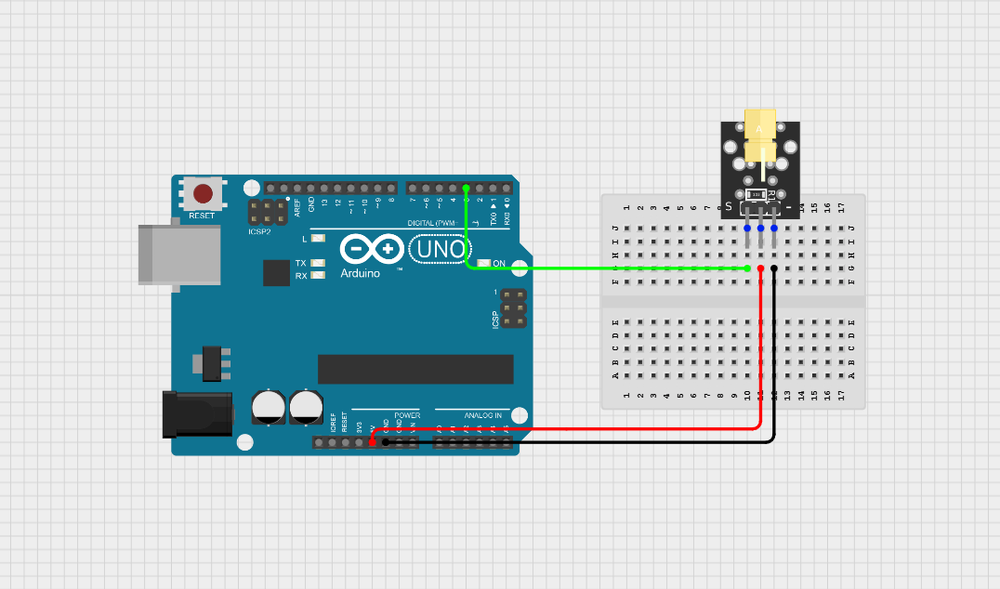
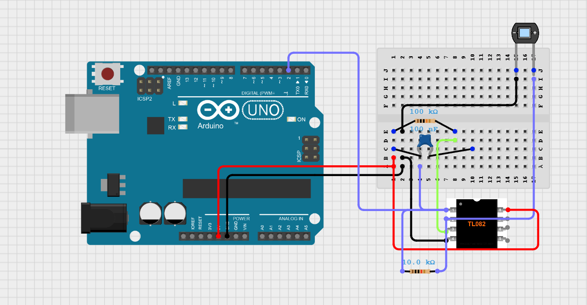

# 🔦 Free-Space Optical (FSO) Communication Link

> An Arduino-based free-space optical communication system that transmits ASCII text wirelessly using a modulated laser beam and reconstructs the message using photodiode-based optical reception.

---

## 📌 Overview

This project implements a low-cost **Free-Space Optical (FSO) communication system** using embedded hardware, analog signal conditioning, and software-based decoding.

A laser diode is used as the optical transmitter, where an Arduino Uno converts text data into ASCII binary and modulates the laser beam accordingly. At the receiver, a photodiode detects incoming optical pulses, and an analog amplifier stage conditions the signal before another Arduino interprets the bitstream.

A Python-based serial logging and decoding utility reconstructs the received binary data into readable ASCII text.

This demonstrates a complete end-to-end optical wireless communication link using simple off-the-shelf components.

---

## 🧠 System Architecture

```text
Text Message Input
        │
        ▼
ASCII Encoding
        │
        ▼
Arduino Uno (Transmitter)
        │
        ▼
Laser Diode Modulation
        │
        ▼
┌─────────────────────────────┐
│   Free-Space Optical Link   │
│     (Laser Beam Channel)    │
└─────────────────────────────┘
        │
        ▼
Photodiode Detection
        │
        ▼
TL082 Signal Conditioning
(Amplification + Thresholding)
        │
        ▼
Arduino Uno (Receiver)
        │
        ▼
Serial Data Logging (Python)
        │
        ▼
Binary-to-ASCII Decoding
        │
        ▼
Recovered Text Output
```

---

## 🔌 Hardware Modules

### 1. Optical Transmitter

The transmitter uses an Arduino Uno to generate binary data from a predefined text string and modulate a laser diode accordingly.

- **Microcontroller:** Arduino Uno (ATmega328P)
- **Optical Source:** KY-008 Laser Diode Module
- **Operation:**
  - ASCII encoding of text
  - Bit-by-bit optical transmission
  - `1 → Laser ON`
  - `0 → Laser OFF`

Bit timing:

- **100 ms per bit**
- Approximate transmission rate: **10 bits/sec**



---

### 2. Optical Receiver

The receiver detects the incoming laser pulses and reconstructs the binary data stream.

- **Optical Detector:** Photodiode
- **Analog Front-End:** TL082 operational amplifier
- **Signal Conditioning:**
  - Optical signal amplification
  - Threshold-based detection
  - Noise filtering
- **Microcontroller:** Arduino Uno

The conditioned signal is sampled by the receiver Arduino to determine incoming logic states.



---

## 🧩 Components Used

| Component | Description |
|---------|-------------|
| Arduino Uno | ATmega328P microcontroller board |
| KY-008 Laser Module | Optical transmitter |
| Photodiode | Optical signal detector |
| TL082 | Dual operational amplifier |
| Potentiometer | Threshold adjustment |
| Resistors | Signal conditioning |
| Capacitor | Analog filtering |
| Breadboard | Prototyping |
| Jumper Wires | Interconnections |

---

## 💻 Software Components

### Transmitter Firmware
Handles:

- ASCII conversion
- Binary framing
- Laser modulation timing
- Optical transmission control

---

### Receiver Firmware
Handles:

- Analog signal sampling
- Threshold detection
- Bitstream reconstruction
- Serial output generation

---

### Python Utilities

#### Serial Logger + Decoder
Functions:

- Serial communication with Arduino
- Real-time binary data capture
- Data logging
- Binary-to-ASCII conversion

#### Standalone Decoder
Functions:

- Reads stored binary data
- Groups into 8-bit ASCII frames
- Converts binary stream into readable text

---

## ⚙️ How It Works

### Step 1 — Encoding
The transmitter converts text into ASCII binary.

Example:

```text
F = 01000110
T = 01010100
```

---

### Step 2 — Optical Transmission
The Arduino modulates the laser beam:

- Binary `1` → Laser ON
- Binary `0` → Laser OFF

The laser beam acts as the free-space communication channel.

---

### Step 3 — Optical Reception
The photodiode detects incoming light intensity variations and converts them into electrical signals.

Because the raw photodiode output is weak, the TL082 analog front-end amplifies and conditions the signal.

---

### Step 4 — Bit Reconstruction
The receiver Arduino samples the conditioned signal at fixed intervals and reconstructs the transmitted binary stream.

---

### Step 5 — Decoding
Python captures the received serial data and converts the binary stream back into ASCII text.

---

## 🎯 Key Design Highlights

- End-to-end optical wireless communication
- Arduino-based transmitter and receiver
- Analog front-end signal conditioning
- Embedded firmware on both ends
- Python-assisted data reconstruction
- Hardware-validated communication
- Modular architecture
- Real embedded + analog + software integration

---

## 📊 Performance

| Parameter | Value |
|---------|-------|
| Transmission Medium | Free-space optical |
| Encoding | ASCII |
| Bit Duration | 100 ms |
| Data Rate | ~10 bits/sec |
| Communication Type | Simplex |
| Detection Method | Threshold-based |
| Validation | Hardware tested |

---

## ⚠️ Limitations

- Sensitive to ambient light interference
- Requires accurate transmitter-receiver alignment
- Low transmission speed
- No clock synchronization protocol
- No error detection/correction
- Limited communication range

---

## 🚀 Future Improvements

Possible upgrades:

- CRC / parity error detection
- Automatic synchronization
- Higher bit rates
- Optical focusing lenses
- Better photodiode amplifier design
- Real-time packet protocol
- STM32-based implementation for faster communication
- Li-Fi style communication system

---

## 📁 Repository Structure

```text
.
├── README.md
├── firmware/
│   ├── tx.ino
│   └── rx.ino
│
├── software/
│   ├── enc.py
│   └── dec.py
│
├── docs/
│   ├── FSO_Project_Report.docx
│   ├── tx.png
│   └── rx.png
```

---

## 🛠️ Getting Started

### Hardware Setup

1. Build transmitter circuit using `tx.png`
2. Build receiver circuit using `rx.png`
3. Upload `tx.ino` to transmitter Arduino
4. Upload `rx.ino` to receiver Arduino
5. Align laser beam with photodiode receiver
6. Adjust threshold if required

---

## 👤 Author

**Barath Raj KB**  
B.E. Electronics & Communication Engineering

---

> *"Turning light into data, and data back into meaning."*
